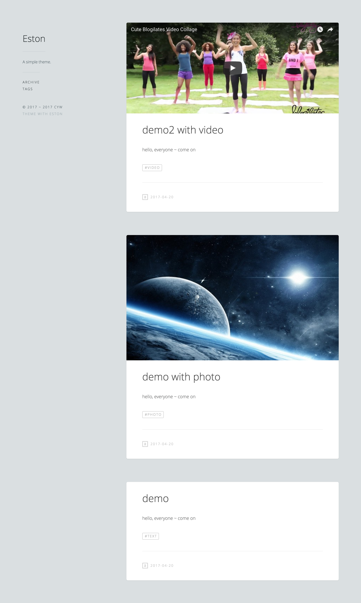

# eston

## Installation

1. git clone this project
2. move your post to the `_posts`
3. enjoy it

## License

The theme is available as open source under the terms of the [MIT License](https://opensource.org/licenses/MIT).

